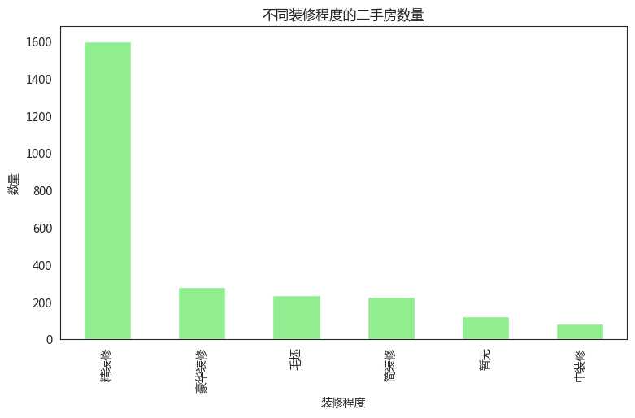

# 练习题A：二手房房价分析与预测

### **一．问题背景**

住房一直以来都是人们关心的热门话题，房价也是人们时时刻刻关心的热点。虽然新房子更加上档次，但是二手房有着现房交易，地段较好，配套设施完善，选择面更加广泛等优势，因此二手房越来越受到广大消费者的青睐。根据现有二手房的地段、装修等属性预估该二手房的价格也是买卖双方所关心的问题。因此通过现有数据，分析并且预测二手房的价格是一项有意义的研究课题。

### **二．解决问题**

#### **1.全市二手房数据分析**

（一）区域二手房均价分析

根据附件中的数据集，将二手房数据按照“区域”属性进行划分，然后计算每个区域的二手房均价，最后将区域及对应的房屋均价信息通过纵向条形图显示。

（二）区域二手房数据及占比分析

根据附件的数据集，计算各个区域二手房数量占总二手房数量的百分比，并画出饼状图。

（三）二手房装修程度分析

将二手房按照“装修”属性进行划分，然后计算不同装修程度的二手房数量，并用条形图显示不同装修程度二手房的数量。

#### **2.二手房房价预测**

（一）将二手房按照户型进行分组，然后提取前5组最热门的二手房户型（出售数量最多的5组户型），最后计算这5个热门户型的均价并画图显示。

（二）选择附件中适合的属性，建立模型预测二手房的价格。

一．问题背景

住房一直以来都是人们关心的热门话题，房价也是人们时时刻刻关心的热点。
虽然新房子更加上档次，但是二手房有着现房交易，地段较好，配套设施完善，选择面更加广泛等优势，因此二手房越来越受到广大消费者的青睐。
根据现有二手房的地段、装修等属性预估该二手房的价格也是买卖双方所关心的问题。因此通过现有数据，分析并且预测二手房的价格是一项有意义的研究课题。

（一）区域二手房均价分析

根据附件中的数据集，将二手房数据按照“区域”属性进行划分，然后计算每个区域的二手房均价，最后将区域及对应的房屋均价信息通过纵向条形图显示。


## 解答

### 特别提示

当然，请看修正后的版本：

1. **均方误差 (Mean Squared Error, MSE)**:
   $
   MSE = \left(1 - \frac{\text{predicted value}}{\text{actual value}}\right)^2
   $
   这个指标衡量了每个预测值与实际值之间的差异的平方，并且在代码中被计算为 `df_result$2`.

2. **预测值与实际值的比率**:
   $
   \text{Ratio} = \frac{\text{predicted value}}{\text{actual value}}
   $
   这个比率可以帮助理解预测值相对于实际值的大小关系，并在代码中被计算为 `df_result$3` 和 `df_result$4`.

3. **比率的最大值**:
   $
   \text{Max Ratio} = \max\left(\frac{\text{predicted value}}{\text{actual value}}, \frac{\text{actual value}}{\text{predicted value}}\right)$
   这个指标考虑了预测值和实际值之间的两种比率，选择了它们的较大值，并在代码中被计算为 `df_result$5`.

这些指标提供了多个角度来评估模型预测的准确性和偏差。在实际应用中，可以根据具体的问题和需求来选择适合的评估指标。


```python
import pandas as pd
import numpy as np
import sklearn
import matplotlib.pyplot as plt
import numpy as np
import pandas as pd
from sklearn.model_selection import train_test_split
from sklearn.preprocessing import StandardScaler
from sklearn.ensemble import RandomForestRegressor, GradientBoostingRegressor
from sklearn.metrics import mean_squared_error
import warnings
import pandas as pd
import seaborn as sns
from pylab import mpl, plt

# best font and style settings for notebook
warnings.filterwarnings('ignore')
sns.set_style("white")
mpl.rcParams['font.family'] = '微软雅黑'
```


```python
df = pd.read_csv("dataset/data.csv", index_col=0)
df_copy = pd.read_csv("dataset/data.csv", index_col=0)
data = df.copy()
```


```python
df.describe()
```


<table border="1" class="dataframe">
  <thead>
    <tr style="text-align: right;">
      <th></th>
      <th>小区名字</th>
      <th>总价</th>
      <th>户型</th>
      <th>建筑面积</th>
      <th>单价</th>
      <th>朝向</th>
      <th>楼层</th>
      <th>装修</th>
      <th>区域</th>
    </tr>
  </thead>
  <tbody>
    <tr>
      <th>count</th>
      <td>2551</td>
      <td>2551</td>
      <td>2551</td>
      <td>2551</td>
      <td>2551</td>
      <td>2551</td>
      <td>2551</td>
      <td>2551</td>
      <td>2551</td>
    </tr>
    <tr>
      <th>unique</th>
      <td>675</td>
      <td>436</td>
      <td>46</td>
      <td>968</td>
      <td>1852</td>
      <td>11</td>
      <td>3</td>
      <td>6</td>
      <td>9</td>
    </tr>
    <tr>
      <th>top</th>
      <td>亚泰梧桐公馆</td>
      <td>105万</td>
      <td>2室2厅1卫</td>
      <td>90平米</td>
      <td>10000元/平米</td>
      <td>南北</td>
      <td>中层</td>
      <td>精装修</td>
      <td>二道</td>
    </tr>
    <tr>
      <th>freq</th>
      <td>45</td>
      <td>49</td>
      <td>953</td>
      <td>64</td>
      <td>29</td>
      <td>2033</td>
      <td>1050</td>
      <td>1602</td>
      <td>490</td>
    </tr>
  </tbody>
</table>


```python
df.head()
```


<table border="1" class="dataframe">
  <thead>
    <tr style="text-align: right;">
      <th></th>
      <th>小区名字</th>
      <th>总价</th>
      <th>户型</th>
      <th>建筑面积</th>
      <th>单价</th>
      <th>朝向</th>
      <th>楼层</th>
      <th>装修</th>
      <th>区域</th>
    </tr>
  </thead>
  <tbody>
    <tr>
      <th>0</th>
      <td>中天北湾新城</td>
      <td>89万</td>
      <td>2室2厅1卫</td>
      <td>89平米</td>
      <td>10000元/平米</td>
      <td>南北</td>
      <td>低层</td>
      <td>毛坯</td>
      <td>高新</td>
    </tr>
    <tr>
      <th>1</th>
      <td>桦林苑</td>
      <td>99.8万</td>
      <td>3室2厅1卫</td>
      <td>143平米</td>
      <td>6979元/平米</td>
      <td>南北</td>
      <td>中层</td>
      <td>毛坯</td>
      <td>净月</td>
    </tr>
    <tr>
      <th>2</th>
      <td>嘉柏湾</td>
      <td>32万</td>
      <td>1室1厅1卫</td>
      <td>43.3平米</td>
      <td>7390元/平米</td>
      <td>南</td>
      <td>高层</td>
      <td>精装修</td>
      <td>经开</td>
    </tr>
    <tr>
      <th>3</th>
      <td>中环12区</td>
      <td>51.5万</td>
      <td>2室1厅1卫</td>
      <td>57平米</td>
      <td>9035元/平米</td>
      <td>南北</td>
      <td>高层</td>
      <td>精装修</td>
      <td>南关</td>
    </tr>
    <tr>
      <th>4</th>
      <td>昊源高格蓝湾</td>
      <td>210万</td>
      <td>3室2厅2卫</td>
      <td>160.8平米</td>
      <td>13060元/平米</td>
      <td>南北</td>
      <td>高层</td>
      <td>精装修</td>
      <td>二道</td>
    </tr>
  </tbody>
</table>


二．解决问题

1.全市二手房数据分析

（一）区域二手房均价分析

根据附件中的数据集，将二手房数据按照“区域”属性进行划分，然后计算每个区域的二手房均价，最后将区域及对应的房屋均价信息通过纵向条形图显示。


```python
# 数据预处理，去掉‘万’和‘元/平米’，将其转换为数值型数据
data['总价'] = data['总价'].str.replace('万', '').astype(np.float16)
data['单价'] = data['单价'].str.replace('元/平米', '').astype(np.float16)

# 按区域分组，计算均价
region_avg_price = data.groupby('区域')['单价'].mean().sort_values()

# 绘制纵向条形图
region_avg_price.plot(kind='barh', figsize=(10, 6), color='skyblue')
plt.xlabel('平均单价 (元/平米)')
plt.ylabel('区域')
plt.title('各区域二手房均价')
plt.show()
```


​    

​    


（二）区域二手房数据及占比分析

根据附件的数据集，计算各个区域二手房数量占总二手房数量的百分比，并画出饼状图。


```python
# 计算各区域二手房数量占比
region_counts = data['区域'].value_counts(normalize=True) * 100

# 绘制饼状图
plt.figure(figsize=(6, 6))
region_counts.plot(kind='pie', autopct='%1.1f%%', startangle=140, colors=plt.cm.Paired(range(len(region_counts))))
plt.ylabel('')
plt.title('各区域二手房数量占比')
plt.axis('equal')
plt.show()

```


​    

​    


（三）二手房装修程度分析

将二手房按照“装修”属性进行划分，然后计算不同装修程度的二手房数量，并用条形图显示不同装修程度二手房的数量。


```python
# 计算不同装修程度二手房数量
decoration_counts = data['装修'].value_counts()

# 绘制条形图
decoration_counts.plot(kind='bar', figsize=(9, 5), color='lightgreen')
plt.xlabel('装修程度')
plt.ylabel('数量')
plt.title('不同装修程度的二手房数量')
plt.show()

```



    


2.二手房房价预测

（一）将二手房按照户型进行分组，然后提取前5组最热门的二手房户型（出售数量最多的5组户型），最后计算这5个热门户型的均价并画图显示。


```python
# 按户型分组，计算各户型的数量
top_5_housetypes = data['户型'].value_counts().head(10).index

# 计算这5个热门户型的均价
top_5_avg_price = data[data['户型'].isin(top_5_housetypes)].groupby('户型')['单价'].mean()

# 绘制条形图
top_5_avg_price.plot(kind='bar', figsize=(9, 5), color='orange')
plt.xlabel('户型')
plt.ylabel('平均单价 (元/平米)')
plt.title('最热门户型的二手房均价')
plt.show()

```


​    

​    


（二）选择附件中适合的属性，建立模型预测二手房的价格。


```python
# 将户型拆分为‘室’、‘厅’、‘卫’
housetype_split = data['户型'].str.extract(r'(\d+)室(\d+)厅(\d+)卫')
housetype_split = housetype_split.fillna(0).astype(int)
data[['室', '厅', '卫']] = housetype_split
data["建筑面积"] = data['建筑面积'].str.replace("平米", "").astype(np.float16)
data['总价'] *= 10000
data
```


<div>
<style scoped>
    .dataframe tbody tr th:only-of-type {
        vertical-align: middle;
    }

    .dataframe tbody tr th {
        vertical-align: top;
    }
    
    .dataframe thead th {
        text-align: right;
    }
</style>
<table border="1" class="dataframe">
  <thead>
    <tr style="text-align: right;">
      <th></th>
      <th>小区名字</th>
      <th>总价</th>
      <th>户型</th>
      <th>建筑面积</th>
      <th>单价</th>
      <th>朝向</th>
      <th>楼层</th>
      <th>装修</th>
      <th>区域</th>
      <th>室</th>
      <th>厅</th>
      <th>卫</th>
    </tr>
  </thead>
  <tbody>
    <tr>
      <th>0</th>
      <td>中天北湾新城</td>
      <td>890000.0</td>
      <td>2室2厅1卫</td>
      <td>89.0000</td>
      <td>10000.0</td>
      <td>南北</td>
      <td>低层</td>
      <td>毛坯</td>
      <td>高新</td>
      <td>2</td>
      <td>2</td>
      <td>1</td>
    </tr>
    <tr>
      <th>1</th>
      <td>桦林苑</td>
      <td>998125.0</td>
      <td>3室2厅1卫</td>
      <td>143.0000</td>
      <td>6980.0</td>
      <td>南北</td>
      <td>中层</td>
      <td>毛坯</td>
      <td>净月</td>
      <td>3</td>
      <td>2</td>
      <td>1</td>
    </tr>
    <tr>
      <th>2</th>
      <td>嘉柏湾</td>
      <td>320000.0</td>
      <td>1室1厅1卫</td>
      <td>43.3125</td>
      <td>7392.0</td>
      <td>南</td>
      <td>高层</td>
      <td>精装修</td>
      <td>经开</td>
      <td>1</td>
      <td>1</td>
      <td>1</td>
    </tr>
    <tr>
      <th>3</th>
      <td>中环12区</td>
      <td>515000.0</td>
      <td>2室1厅1卫</td>
      <td>57.0000</td>
      <td>9032.0</td>
      <td>南北</td>
      <td>高层</td>
      <td>精装修</td>
      <td>南关</td>
      <td>2</td>
      <td>1</td>
      <td>1</td>
    </tr>
    <tr>
      <th>4</th>
      <td>昊源高格蓝湾</td>
      <td>2100000.0</td>
      <td>3室2厅2卫</td>
      <td>160.7500</td>
      <td>13056.0</td>
      <td>南北</td>
      <td>高层</td>
      <td>精装修</td>
      <td>二道</td>
      <td>3</td>
      <td>2</td>
      <td>2</td>
    </tr>
    <tr>
      <th>...</th>
      <td>...</td>
      <td>...</td>
      <td>...</td>
      <td>...</td>
      <td>...</td>
      <td>...</td>
      <td>...</td>
      <td>...</td>
      <td>...</td>
      <td>...</td>
      <td>...</td>
      <td>...</td>
    </tr>
    <tr>
      <th>57</th>
      <td>园丁花园</td>
      <td>1150000.0</td>
      <td>3室2厅2卫</td>
      <td>154.0000</td>
      <td>7472.0</td>
      <td>南北</td>
      <td>低层</td>
      <td>精装修</td>
      <td>净月</td>
      <td>3</td>
      <td>2</td>
      <td>2</td>
    </tr>
    <tr>
      <th>58</th>
      <td>枫林园</td>
      <td>998125.0</td>
      <td>2室2厅1卫</td>
      <td>91.3125</td>
      <td>10928.0</td>
      <td>南北</td>
      <td>中层</td>
      <td>精装修</td>
      <td>二道</td>
      <td>2</td>
      <td>2</td>
      <td>1</td>
    </tr>
    <tr>
      <th>59</th>
      <td>经开四区</td>
      <td>750000.0</td>
      <td>2室2厅1卫</td>
      <td>110.0000</td>
      <td>6816.0</td>
      <td>南北</td>
      <td>中层</td>
      <td>精装修</td>
      <td>经开</td>
      <td>2</td>
      <td>2</td>
      <td>1</td>
    </tr>
    <tr>
      <th>0</th>
      <td>华盛碧水云天</td>
      <td>1000000.0</td>
      <td>2室2厅1卫</td>
      <td>109.7500</td>
      <td>9112.0</td>
      <td>南北</td>
      <td>中层</td>
      <td>精装修</td>
      <td>汽开</td>
      <td>2</td>
      <td>2</td>
      <td>1</td>
    </tr>
    <tr>
      <th>1</th>
      <td>吉盛小区</td>
      <td>488125.0</td>
      <td>2室2厅1卫</td>
      <td>61.0000</td>
      <td>8000.0</td>
      <td>南北</td>
      <td>高层</td>
      <td>精装修</td>
      <td>二道</td>
      <td>2</td>
      <td>2</td>
      <td>1</td>
    </tr>
  </tbody>
</table>
<p>2583 rows × 12 columns</p>
</div>


```python
data_quant = data.drop(columns=['户型'])
data_quant = data_quant.dropna()
data_quant
```


<table border="1" class="dataframe">
  <thead>
    <tr style="text-align: right;">
      <th></th>
      <th>小区名字</th>
      <th>总价</th>
      <th>建筑面积</th>
      <th>单价</th>
      <th>朝向</th>
      <th>楼层</th>
      <th>装修</th>
      <th>区域</th>
      <th>室</th>
      <th>厅</th>
      <th>卫</th>
    </tr>
  </thead>
  <tbody>
    <tr>
      <th>0</th>
      <td>中天北湾新城</td>
      <td>890000.0</td>
      <td>89.0000</td>
      <td>10000.0</td>
      <td>南北</td>
      <td>低层</td>
      <td>毛坯</td>
      <td>高新</td>
      <td>2</td>
      <td>2</td>
      <td>1</td>
    </tr>
    <tr>
      <th>1</th>
      <td>桦林苑</td>
      <td>998125.0</td>
      <td>143.0000</td>
      <td>6980.0</td>
      <td>南北</td>
      <td>中层</td>
      <td>毛坯</td>
      <td>净月</td>
      <td>3</td>
      <td>2</td>
      <td>1</td>
    </tr>
    <tr>
      <th>2</th>
      <td>嘉柏湾</td>
      <td>320000.0</td>
      <td>43.3125</td>
      <td>7392.0</td>
      <td>南</td>
      <td>高层</td>
      <td>精装修</td>
      <td>经开</td>
      <td>1</td>
      <td>1</td>
      <td>1</td>
    </tr>
    <tr>
      <th>3</th>
      <td>中环12区</td>
      <td>515000.0</td>
      <td>57.0000</td>
      <td>9032.0</td>
      <td>南北</td>
      <td>高层</td>
      <td>精装修</td>
      <td>南关</td>
      <td>2</td>
      <td>1</td>
      <td>1</td>
    </tr>
    <tr>
      <th>4</th>
      <td>昊源高格蓝湾</td>
      <td>2100000.0</td>
      <td>160.7500</td>
      <td>13056.0</td>
      <td>南北</td>
      <td>高层</td>
      <td>精装修</td>
      <td>二道</td>
      <td>3</td>
      <td>2</td>
      <td>2</td>
    </tr>
    <tr>
      <th>...</th>
      <td>...</td>
      <td>...</td>
      <td>...</td>
      <td>...</td>
      <td>...</td>
      <td>...</td>
      <td>...</td>
      <td>...</td>
      <td>...</td>
      <td>...</td>
      <td>...</td>
    </tr>
    <tr>
      <th>57</th>
      <td>园丁花园</td>
      <td>1150000.0</td>
      <td>154.0000</td>
      <td>7472.0</td>
      <td>南北</td>
      <td>低层</td>
      <td>精装修</td>
      <td>净月</td>
      <td>3</td>
      <td>2</td>
      <td>2</td>
    </tr>
    <tr>
      <th>58</th>
      <td>枫林园</td>
      <td>998125.0</td>
      <td>91.3125</td>
      <td>10928.0</td>
      <td>南北</td>
      <td>中层</td>
      <td>精装修</td>
      <td>二道</td>
      <td>2</td>
      <td>2</td>
      <td>1</td>
    </tr>
    <tr>
      <th>59</th>
      <td>经开四区</td>
      <td>750000.0</td>
      <td>110.0000</td>
      <td>6816.0</td>
      <td>南北</td>
      <td>中层</td>
      <td>精装修</td>
      <td>经开</td>
      <td>2</td>
      <td>2</td>
      <td>1</td>
    </tr>
    <tr>
      <th>0</th>
      <td>华盛碧水云天</td>
      <td>1000000.0</td>
      <td>109.7500</td>
      <td>9112.0</td>
      <td>南北</td>
      <td>中层</td>
      <td>精装修</td>
      <td>汽开</td>
      <td>2</td>
      <td>2</td>
      <td>1</td>
    </tr>
    <tr>
      <th>1</th>
      <td>吉盛小区</td>
      <td>488125.0</td>
      <td>61.0000</td>
      <td>8000.0</td>
      <td>南北</td>
      <td>高层</td>
      <td>精装修</td>
      <td>二道</td>
      <td>2</td>
      <td>2</td>
      <td>1</td>
    </tr>
  </tbody>
</table>
<p>2551 rows × 11 columns</p>


```python
# 特征工程，进行one-hot编码
data_quant = pd.get_dummies(data_quant,
                            columns=['朝向', '楼层', '装修', '区域'],
                            drop_first=True)
print(data_quant.columns)
data_quant
```

    Index(['小区名字', '总价', '建筑面积', '单价', '室', '厅', '卫', '朝向_东北', '朝向_东南', '朝向_东西',
           '朝向_北', '朝向_南', '朝向_南北', '朝向_暂无', '朝向_西', '朝向_西北', '朝向_西南', '楼层_低层',
           '楼层_高层', '装修_暂无', '装修_毛坯', '装修_简装修', '装修_精装修', '装修_豪华装修', '区域_净月',
           '区域_南关', '区域_宽城', '区域_朝阳', '区域_汽开', '区域_经开', '区域_绿园', '区域_高新'],
          dtype='object')


<table border="1" class="dataframe">
  <thead>
    <tr style="text-align: right;">
      <th></th>
      <th>小区名字</th>
      <th>总价</th>
      <th>建筑面积</th>
      <th>单价</th>
      <th>室</th>
      <th>厅</th>
      <th>卫</th>
      <th>朝向_东北</th>
      <th>朝向_东南</th>
      <th>朝向_东西</th>
      <th>...</th>
      <th>装修_精装修</th>
      <th>装修_豪华装修</th>
      <th>区域_净月</th>
      <th>区域_南关</th>
      <th>区域_宽城</th>
      <th>区域_朝阳</th>
      <th>区域_汽开</th>
      <th>区域_经开</th>
      <th>区域_绿园</th>
      <th>区域_高新</th>
    </tr>
  </thead>
  <tbody>
    <tr>
      <th>0</th>
      <td>中天北湾新城</td>
      <td>890000.0</td>
      <td>89.0000</td>
      <td>10000.0</td>
      <td>2</td>
      <td>2</td>
      <td>1</td>
      <td>False</td>
      <td>False</td>
      <td>False</td>
      <td>...</td>
      <td>False</td>
      <td>False</td>
      <td>False</td>
      <td>False</td>
      <td>False</td>
      <td>False</td>
      <td>False</td>
      <td>False</td>
      <td>False</td>
      <td>True</td>
    </tr>
    <tr>
      <th>1</th>
      <td>桦林苑</td>
      <td>998125.0</td>
      <td>143.0000</td>
      <td>6980.0</td>
      <td>3</td>
      <td>2</td>
      <td>1</td>
      <td>False</td>
      <td>False</td>
      <td>False</td>
      <td>...</td>
      <td>False</td>
      <td>False</td>
      <td>True</td>
      <td>False</td>
      <td>False</td>
      <td>False</td>
      <td>False</td>
      <td>False</td>
      <td>False</td>
      <td>False</td>
    </tr>
    <tr>
      <th>2</th>
      <td>嘉柏湾</td>
      <td>320000.0</td>
      <td>43.3125</td>
      <td>7392.0</td>
      <td>1</td>
      <td>1</td>
      <td>1</td>
      <td>False</td>
      <td>False</td>
      <td>False</td>
      <td>...</td>
      <td>True</td>
      <td>False</td>
      <td>False</td>
      <td>False</td>
      <td>False</td>
      <td>False</td>
      <td>False</td>
      <td>True</td>
      <td>False</td>
      <td>False</td>
    </tr>
    <tr>
      <th>3</th>
      <td>中环12区</td>
      <td>515000.0</td>
      <td>57.0000</td>
      <td>9032.0</td>
      <td>2</td>
      <td>1</td>
      <td>1</td>
      <td>False</td>
      <td>False</td>
      <td>False</td>
      <td>...</td>
      <td>True</td>
      <td>False</td>
      <td>False</td>
      <td>True</td>
      <td>False</td>
      <td>False</td>
      <td>False</td>
      <td>False</td>
      <td>False</td>
      <td>False</td>
    </tr>
    <tr>
      <th>4</th>
      <td>昊源高格蓝湾</td>
      <td>2100000.0</td>
      <td>160.7500</td>
      <td>13056.0</td>
      <td>3</td>
      <td>2</td>
      <td>2</td>
      <td>False</td>
      <td>False</td>
      <td>False</td>
      <td>...</td>
      <td>True</td>
      <td>False</td>
      <td>False</td>
      <td>False</td>
      <td>False</td>
      <td>False</td>
      <td>False</td>
      <td>False</td>
      <td>False</td>
      <td>False</td>
    </tr>
    <tr>
      <th>...</th>
      <td>...</td>
      <td>...</td>
      <td>...</td>
      <td>...</td>
      <td>...</td>
      <td>...</td>
      <td>...</td>
      <td>...</td>
      <td>...</td>
      <td>...</td>
      <td>...</td>
      <td>...</td>
      <td>...</td>
      <td>...</td>
      <td>...</td>
      <td>...</td>
      <td>...</td>
      <td>...</td>
      <td>...</td>
      <td>...</td>
      <td>...</td>
    </tr>
    <tr>
      <th>57</th>
      <td>园丁花园</td>
      <td>1150000.0</td>
      <td>154.0000</td>
      <td>7472.0</td>
      <td>3</td>
      <td>2</td>
      <td>2</td>
      <td>False</td>
      <td>False</td>
      <td>False</td>
      <td>...</td>
      <td>True</td>
      <td>False</td>
      <td>True</td>
      <td>False</td>
      <td>False</td>
      <td>False</td>
      <td>False</td>
      <td>False</td>
      <td>False</td>
      <td>False</td>
    </tr>
    <tr>
      <th>58</th>
      <td>枫林园</td>
      <td>998125.0</td>
      <td>91.3125</td>
      <td>10928.0</td>
      <td>2</td>
      <td>2</td>
      <td>1</td>
      <td>False</td>
      <td>False</td>
      <td>False</td>
      <td>...</td>
      <td>True</td>
      <td>False</td>
      <td>False</td>
      <td>False</td>
      <td>False</td>
      <td>False</td>
      <td>False</td>
      <td>False</td>
      <td>False</td>
      <td>False</td>
    </tr>
    <tr>
      <th>59</th>
      <td>经开四区</td>
      <td>750000.0</td>
      <td>110.0000</td>
      <td>6816.0</td>
      <td>2</td>
      <td>2</td>
      <td>1</td>
      <td>False</td>
      <td>False</td>
      <td>False</td>
      <td>...</td>
      <td>True</td>
      <td>False</td>
      <td>False</td>
      <td>False</td>
      <td>False</td>
      <td>False</td>
      <td>False</td>
      <td>True</td>
      <td>False</td>
      <td>False</td>
    </tr>
    <tr>
      <th>0</th>
      <td>华盛碧水云天</td>
      <td>1000000.0</td>
      <td>109.7500</td>
      <td>9112.0</td>
      <td>2</td>
      <td>2</td>
      <td>1</td>
      <td>False</td>
      <td>False</td>
      <td>False</td>
      <td>...</td>
      <td>True</td>
      <td>False</td>
      <td>False</td>
      <td>False</td>
      <td>False</td>
      <td>False</td>
      <td>True</td>
      <td>False</td>
      <td>False</td>
      <td>False</td>
    </tr>
    <tr>
      <th>1</th>
      <td>吉盛小区</td>
      <td>488125.0</td>
      <td>61.0000</td>
      <td>8000.0</td>
      <td>2</td>
      <td>2</td>
      <td>1</td>
      <td>False</td>
      <td>False</td>
      <td>False</td>
      <td>...</td>
      <td>True</td>
      <td>False</td>
      <td>False</td>
      <td>False</td>
      <td>False</td>
      <td>False</td>
      <td>False</td>
      <td>False</td>
      <td>False</td>
      <td>False</td>
    </tr>
  </tbody>
</table>
<p>2551 rows × 32 columns</p>


```python
data_quant.columns
```


    Index(['小区名字', '总价', '建筑面积', '单价', '室', '厅', '卫', '朝向_东北', '朝向_东南', '朝向_东西',
           '朝向_北', '朝向_南', '朝向_南北', '朝向_暂无', '朝向_西', '朝向_西北', '朝向_西南', '楼层_低层',
           '楼层_高层', '装修_暂无', '装修_毛坯', '装修_简装修', '装修_精装修', '装修_豪华装修', '区域_净月',
           '区域_南关', '区域_宽城', '区域_朝阳', '区域_汽开', '区域_经开', '区域_绿园', '区域_高新'],
          dtype='object')


```python
# 提取特征和目标变量
features = data_quant.copy()
```


```python
features = features.dropna()
target_unit_price = features['单价'].copy()
target_total_price = features['总价'].copy()
features = features.drop(columns=['单价', '总价', '小区名字', '建筑面积'])
```


```python
features.columns
```


    Index(['室', '厅', '卫', '朝向_东北', '朝向_东南', '朝向_东西', '朝向_北', '朝向_南', '朝向_南北',
           '朝向_暂无', '朝向_西', '朝向_西北', '朝向_西南', '楼层_低层', '楼层_高层', '装修_暂无', '装修_毛坯',
           '装修_简装修', '装修_精装修', '装修_豪华装修', '区域_净月', '区域_南关', '区域_宽城', '区域_朝阳',
           '区域_汽开', '区域_经开', '区域_绿园', '区域_高新'],
          dtype='object')


```python
# 分割数据集为训练集和测试集

X_train_unit, X_test_unit, y_train_unit, y_test_unit = train_test_split(
    features, target_unit_price, test_size=0.2, random_state=42)
X_train_total, X_test_total, y_train_total, y_test_total = train_test_split(
    features, target_total_price, test_size=0.2, random_state=42)

```


```python
from sklearn.linear_model import LinearRegression

li = LinearRegression()
# 拟合数据
li.fit(X_train_unit, y_train_unit)


df_result = pd.DataFrame([list(li.predict(X_test_unit)), y_test_unit]).T
df_result[2] = (1 - (df_result[0] / df_result[1]))**2
df_result[3] = df_result[0] / df_result[1]
df_result[4] = df_result[1] / df_result[0]
df_result[5] = np.max([df_result[3], df_result[4]],axis=0)
df_result.mean()
```


    0    10444.276603
    1    10427.780822
    2        0.091912
    3        1.066741
    4        0.999816
    5        1.227557
    dtype: float64


```python
li = LinearRegression()
# 拟合数据
li.fit(X_train_total, y_train_total)
df_result = pd.DataFrame([list(li.predict(X_test_total)), y_test_total]).T
df_result[2] = (1 - (df_result[0] / df_result[1]))**2
df_result[3] = df_result[0] / df_result[1]
df_result[4] = df_result[1] / df_result[0]
df_result[5] = np.max([df_result[3], df_result[4]], axis=0)
df_result.mean()
```


    0    1.091741e+06
    1    1.129259e+06
    2    1.786713e-01
    3    1.058368e+00
    4    1.019416e+00
    5    1.323347e+00
    dtype: float64


```python
df_result
```

<table border="1" class="dataframe">
  <thead>
    <tr style="text-align: right;">
      <th></th>
      <th>0</th>
      <th>1</th>
      <th>2</th>
      <th>3</th>
      <th>4</th>
      <th>5</th>
    </tr>
  </thead>
  <tbody>
    <tr>
      <th>0</th>
      <td>406135.249667</td>
      <td>364062.5</td>
      <td>0.013355</td>
      <td>1.115565</td>
      <td>0.896407</td>
      <td>1.115565</td>
    </tr>
    <tr>
      <th>1</th>
      <td>691283.448016</td>
      <td>698125.0</td>
      <td>0.000096</td>
      <td>0.990200</td>
      <td>1.009897</td>
      <td>1.009897</td>
    </tr>
    <tr>
      <th>2</th>
      <td>250415.483411</td>
      <td>130000.0</td>
      <td>0.857982</td>
      <td>1.926273</td>
      <td>0.519137</td>
      <td>1.926273</td>
    </tr>
    <tr>
      <th>3</th>
      <td>824317.870453</td>
      <td>990000.0</td>
      <td>0.028008</td>
      <td>0.832644</td>
      <td>1.200993</td>
      <td>1.200993</td>
    </tr>
    <tr>
      <th>4</th>
      <td>578331.260403</td>
      <td>650000.0</td>
      <td>0.012157</td>
      <td>0.889740</td>
      <td>1.123923</td>
      <td>1.123923</td>
    </tr>
    <tr>
      <th>...</th>
      <td>...</td>
      <td>...</td>
      <td>...</td>
      <td>...</td>
      <td>...</td>
      <td>...</td>
    </tr>
    <tr>
      <th>506</th>
      <td>562145.822825</td>
      <td>450000.0</td>
      <td>0.062107</td>
      <td>1.249213</td>
      <td>0.800504</td>
      <td>1.249213</td>
    </tr>
    <tr>
      <th>507</th>
      <td>555005.747061</td>
      <td>660000.0</td>
      <td>0.025307</td>
      <td>0.840918</td>
      <td>1.189177</td>
      <td>1.189177</td>
    </tr>
    <tr>
      <th>508</th>
      <td>570875.706999</td>
      <td>620000.0</td>
      <td>0.006278</td>
      <td>0.920767</td>
      <td>1.086051</td>
      <td>1.086051</td>
    </tr>
    <tr>
      <th>509</th>
      <td>691283.448016</td>
      <td>850000.0</td>
      <td>0.034866</td>
      <td>0.813275</td>
      <td>1.229597</td>
      <td>1.229597</td>
    </tr>
    <tr>
      <th>510</th>
      <td>551859.227477</td>
      <td>408125.0</td>
      <td>0.124032</td>
      <td>1.352182</td>
      <td>0.739545</td>
      <td>1.352182</td>
    </tr>
  </tbody>
</table>
<p>511 rows × 6 columns</p>


```python
!jupyter nbconvert --to html demo-2-2.ipynb
!jupyter nbconvert --to markdown demo-2-2.ipynb
```

    [NbConvertApp] Converting notebook demo-2-2.ipynb to html
    [NbConvertApp] Writing 496935 bytes to demo-2-2.html
